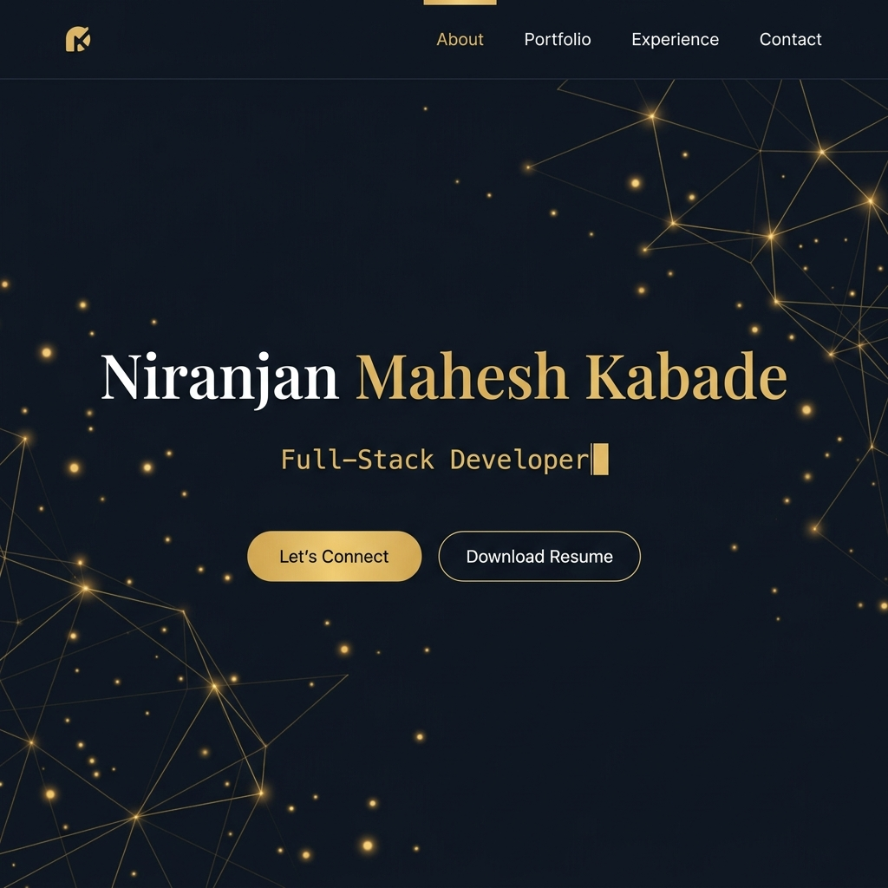
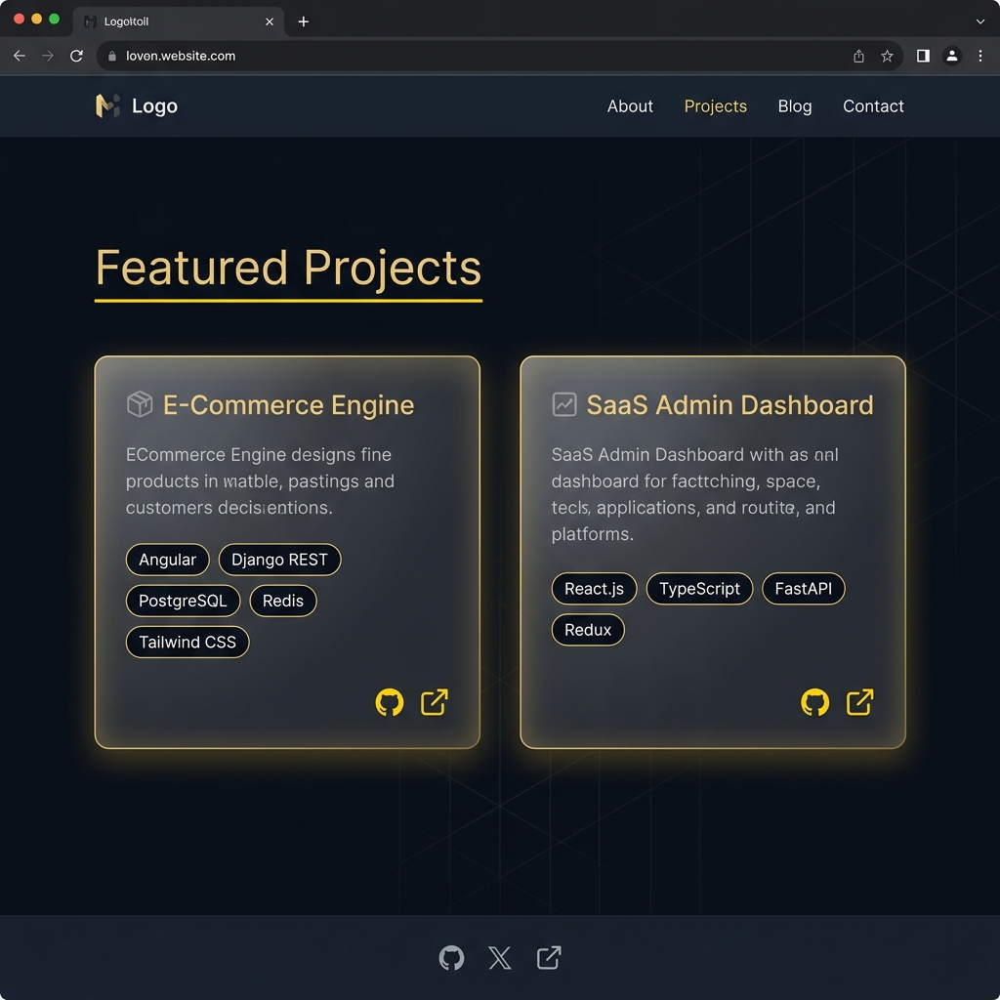

# 🌟 Niranjan Mahesh Kabade - Personal Portfolio

A sleek, premium, modern single-page developer portfolio designed to showcase software engineering expertise, SaaS architectures, and full-stack capabilities. 

Built with **Angular 18**, **Tailwind CSS**, and **ngx-particles** on the frontend, combined with a **Django REST Framework** backend.

---

## 📸 Portfolio Screenshots

### 🖥️ Hero Section
An elegant, dark-themed hero landing with a dynamic typing effect, floating gold particles, and custom interactive canvas nodes.


### 🚀 Featured Projects
A glassmorphic, responsive grid showcasing full-stack projects complete with technology tags, descriptive pipelines, and repository links.


---

## ✨ Features

- **Premium Modern Design**: Tailored HSL color palette featuring deep slate (`#0B0F19`) and warm gold accents (`#d4af37`).
- **Dynamic Particle Effects**: Real-time canvas interactive particle system responding to user clicks and mouse hover.
- **Micro-Animations & Smooth Scrolling**: Optimized navigation with fluid scrolling transitions between sections.
- **Responsive Architecture**: Fully optimized layout for mobile, tablet, and ultra-wide desktop monitors.
- **Robust Component Library**: Reusable UI blocks including:
  - **Hero** with auto-typing status lines
  - **About Me** intro card
  - **Interactive Skills Grid**
  - **Experience & Education Timeline**
  - **Projects Gallery** with glassmorphic cards
  - **Contact Form** with API verification

---

## 🛠️ Tech Stack

### Frontend
- **Framework**: Angular 18 (Standalone Components)
- **Styling**: Tailwind CSS & SCSS
- **Icons**: Lucide Angular
- **Effects**: tsparticles (Engine & Slim)

### Backend
- **Framework**: Django & Django REST Framework
- **Database**: SQLite3 / PostgreSQL
- **Task Queue**: Celery & Redis (for background jobs)
- **Authentication**: JWT-based Auth

---

## 🚀 Quick Start

### Prerequisites
- Node.js (v18.x or later)
- Python 3.10+
- Angular CLI

### 1. Frontend Setup
```bash
cd portfolio_frontend
npm install
npm start
```
Frontend will be available at `http://localhost:4200/`.

### 2. Backend Setup
```bash
cd portfolio_backend
# Activate virtual environment
venv\Scripts\activate   # Windows
source venv/bin/activate # Unix/macOS

# Install dependencies & run migrations
pip install -r requirements.txt
python manage.py migrate
python manage.py runserver
```
Backend API will be available at `http://127.0.0.1:8000/`.
